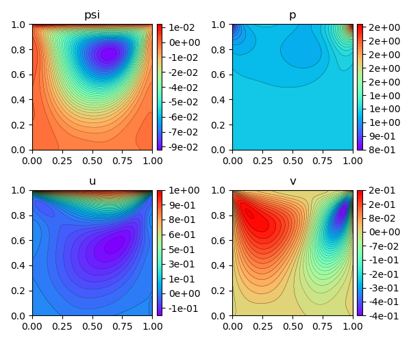

# pinn_cavity

This module implements the Physics Informed Neural Network (PINN) model for the cavity flow governed by the equation of continuity and the steady Navier-Stokes equation in two dimensions. They are given by

* `u_x + v_y = 0,`
* `u*u_x + v*u_y + p_x/rho - nu*(u_xx + u_yy) = 0,`
* `u*v_x + v*v_y + p_y/rho - nu*(v_xx + v_yy) = 0,`

where `(u, v)` is the flow velocity, `p` is the pressure, `_x, _y` indicate 1st derivatives `d/dx, d/dy`, `_xx, _yy` indicate 2nd derivatives `d2/dx2, d2/dy2`, `rho` is the density and `nu` is the viscosity. To fill the equation of continuity automatically, he sake of simplicity, we use the stream function `psi` given by `(u = psi_y, v = -psi_x)`. For the cavity flow in the range `x, y = 0 ~ 1`, we give boundary conditions: `u=1, v=0` at top boundary; `u=0, v=0` at other boundaries, where Reynolds number `Re=100` for `rho=1` and `nu=0.01`. The PINN model predicts `(psi, p)` for the input `(x, y)`.

## Description

The PINN is a deep learning approach to solve partial differential equations. Well-known finite difference, volume and element methods are formulated on discrete meshes to approximate derivatives. Meanwhile, the automatic differentiation using neural networks provides differential operations directly. The PINN is the automatic differentiation based solver and has an advantage of being meshless.

The effectiveness of PINNs is validated in the following works.

* [M. Raissi, et al., Physics Informed Deep Learning (Part I): Data-driven Solutions of Nonlinear Partial Differential Equations, arXiv: 1711.10561 (2017).](https://arxiv.org/abs/1711.10561)
* [M. Raissi, et al., Physics Informed Deep Learning (Part II): Data-driven Discovery of Nonlinear Partial Differential Equations, arXiv: 1711.10566 (2017).](https://arxiv.org/abs/1711.10566)

In addition, an effective convergent optimizer is required to solve the differential equations accurately using PINNs. The stochastic gradient dicent is generally used in deep learnigs, but it only depends on the primary gradient (Jacobian). In contrast, the quasi-Newton based approach such as the limited-memory Broyden-Fletcher-Goldfarb-Shanno method for bound constraints (L-BFGS-B) incorporates the quadratic gradient (Hessian), and gives a more accurate convergence.

Here we implement a PINN model with the L-BFGS-B optimization for the steady Navier-Stokes equation. In order to improve the convergence, we adopt **swish activation** in `network.py` and **logcosh loss** in `optimizer.py` .  
Scripts is given as follows.

* *lib : libraries to implement the PINN model for a projectile motion.*
    * `layer.py` : computing derivatives as a custom layer.
    * `network.py` : building a keras network model.
    * `optimizer.py` : implementing the L-BFGS-B optimization.
    * `pinn.py` : building a PINN model.
    * `tf_silent.py` : suppressing tensorflow warnings
* `main.py` : main routine to run and test the PINN solver.

## Requirement

You need Python 3.6 and the following packages.

| package    | version (recommended) |
| -          | -      |
| matplotlib | 3.2.1  |
| numpy      | 1.18.1 |
| scipy      | 1.3.1  |
| tensorflow | 2.1.0  |

GPU acceleration is recommended in the following environments.

| package        | version (recommended) |
| -              | -     |
| cuda           | 10.1  |
| cudnn          | 7.6.5 |
| tensorflow-gpu | 2.1.0 |

## Usage

An example of PINN solver for the wave equation is implemented in `main.py`. The PINN is trained by the following procedure.

1. Building the keras network model
    ```python
    from lib.network import Network
    network = Network().build().
    network.summary()
    ```
    The following table depicts layers in the default network.
    ```
    _________________________________________________________________
    Layer (type)                 Output Shape              Param #
    =================================================================
    input_1 (InputLayer)         [(None, 2)]               0
    _________________________________________________________________
    dense (Dense)                (None, 32)                96
    _________________________________________________________________
    dense_1 (Dense)              (None, 16)                528
    _________________________________________________________________
    dense_2 (Dense)              (None, 16)                272
    _________________________________________________________________
    dense_3 (Dense)              (None, 32)                544
    _________________________________________________________________
    dense_4 (Dense)              (None, 2)                 66
    =================================================================
    Total params: 1,506
    Trainable params: 1,506
    Non-trainable params: 0
    _________________________________________________________________
    ```
2. Building the PINN model.
    ```python
    from lib.pinn import PINN
    pinn = PINN(network, rho=1, nu=0.01).build()
    ```
3. Building training input.
    ```python
    # create training input
    xy_eqn = np.random.rand(num_train_samples, 2)
    xy_ub = np.random.rand(num_train_samples//2, 2)  # top-bottom boundaries
    xy_ub[..., 1] = np.round(xy_ub[..., 1])          # y-position is 0 or 1
    xy_lr = np.random.rand(num_train_samples//2, 2)  # left-right boundaries
    xy_lr[..., 0] = np.round(xy_lr[..., 0])          # x-position is 0 or 1
    xy_bnd = np.random.permutation(np.concatenate([xy_ub, xy_lr]))
    x_train = [xy_eqn, xy_bnd]
    ```
4. Building training output. We give the inlet velocity `u0=1`.
    ```python
    # create training output
    zeros = np.zeros((num_train_samples, 2))
    uv_bnd = np.zeros((num_train_samples, 2))
    uv_bnd[..., 0] = u0 * np.floor(xy_bnd[..., 1])
    y_train = [zeros, zeros, uv_bnd]
    ```
5. Optimizing the PINN model for the training data.
    ```python
    from lib.optimizer import L_BFGS_B
    lbfgs = L_BFGS_B(model=pinn, x_train=x_train, y_train=y_train)
    lbfgs.fit()
    ```
    The progress is printed as follows. The optimization is terminated for loss ~ 1.8e-4.
    ```
    Optimizer: L-BFGS-B (maxiter=20000)
    9151/20000 [============>.................] - ETA: 17:56 - loss: 1.8428e-04
    ```

An example result (Reynolds number `Re=100`) is demonstrated below.

